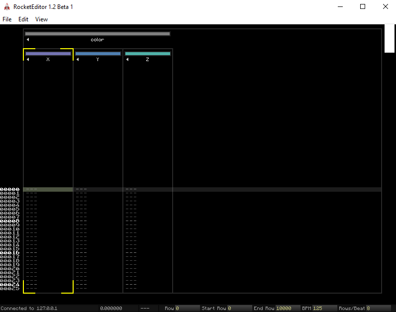

# FRACTAL ENGINE

> This is a ready to use engine, that provide the minimun to run a demo.

## HOW TO RUN 

 1. Clone this projet
 2. Load a music using this code 
 
 ```c++
 	s.PlayMusic("your_music_path");
 ``` 

 3. Open  editor
 4. You can now run the projet

## Main Functions

`BASIC CODE STRUCTURE`

> You will need this code to run the projet perfectly.

```c++

	do
	{
		syncTracker.Update(s);
		renderer.Render();
		file.UpdateFile(renderer, window, float(s.CurrentTime()));
        
	} while (window.SwapBuffers()/* && (SoundTrack::ms_IsPlaying(&s))  <-- this is used for .exe only*/);


```

`LOAD A MUSIC`

```c++
    	s.PlayMusic("your_music_path");
```

`PUSH A VALUE INTO SHADER FILE + ROCKET`

> You need to write those lines above the basic code structure in the main.cpp do while function.

IN C++

```c++
	glm::vec3 color = glm::vec3(1.0f, 0.0f, 0.0f);
    
	color.x = syncTracker.FetchValue("color:X");
	color.y = syncTracker.FetchValue("color:Y");
	color.z = syncTracker.FetchValue("color:Z");

	glProgramUniform3f(renderer.m_shader, 3, color.x, color.y, color.z);
```

IN SHADER

```glsl

layout(location = 3) uniform vec3 uColor;

void main()
{
	FragColor = vec4(uColor, 1.0);
}

```

WHAT IT LOOKS LIKE

 
